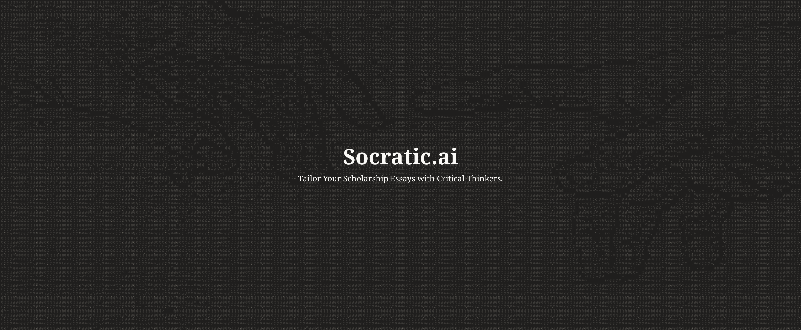

# Socratic AI

> Tailor Your Scholarship Essays with Critical Thinkers.

## About

Generic AI tools generate polished but ineffective scholarship essays because they don't understand that each scholarship seeks specific types of students. Socratic AI uses Socratic questioning to extract authentic stories and guide strategic positioning, helping students reframe their experiences to align with what different scholarships truly value while maintaining their authentic voice. Built on analysis of 26+ major Canadian scholarships, our AI acts like an expert scholarship coach that decodes hidden selection criteria and teaches effective storytelling.

### Hackathon Requirements

-   Find the prompts we used to the LLM in `/docs/research/prompts`
-   Find the Research with 25+ scholarships and award profiles in `/docs/research/25 Scholarships and Award Profiles.pdf`
-   Use our app [Here](https://socraticai.vercel.app/)

## Getting Started

### Prerequisites

-   Node.js (v18+)
-   npm or yarn
-   Anthropic API key

### Installation

``` bash
# Clone the repository
git clone https://github.com/Karl-Michaud/anthropic-hackathon.git
cd anthropic-hackathon/app

# Install dependencies
npm install
```

### Environment Setup

Create a `.env.local` file in the `app` directory:

``` bash
ANTHROPIC_API_KEY=your_api_key_here
NEXT_PUBLIC_APP_URL=http://localhost:3000
```

### Running the Application

``` bash
# Development mode
npm run dev

# Production build
npm run build
npm start
```

Visit `http://localhost:3000` in your browser.

## Tech Stack

-   **Frontend**: React, Next.js, TypeScript
-   **AI**: Anthropic Claude (Sonnet 4.5)
-   **Styling**: Tailwind CSS
-   **Deployment**: Vercel

## Contributors

Built by [Karl Michaud](https://github.com/Karl-Michaud), [David Dimalanta](https://github.com/davidjamesdimalanta), [Kevin Pogoryelovskyy](https://github.com/KelvinPogo), [Chisom Onyekwere](https://github.com/ochisomonyekwere-ship-it), and [Leo Duan](https://github.com/leoduan0).

## License

MIT License - see LICENSE file for details
